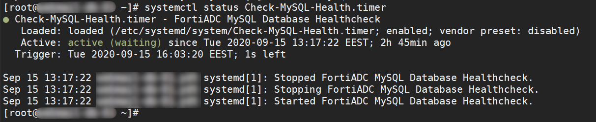

# FortiADC-MySQL-Healthcheck
Solution for MySQL healthcheck on FortiADC using bash, ncat, mysql and systemd.

## Installation

### Execute the following commands as root on each database node

1. `mysql -u root -p < requirements.sql`
2. `bash install.sh`

### Set up the healthcheck on FortiADC

> Find the required script for FortiADC [here](FortiADC/HealthCheckScript.sh)

